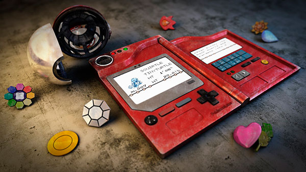
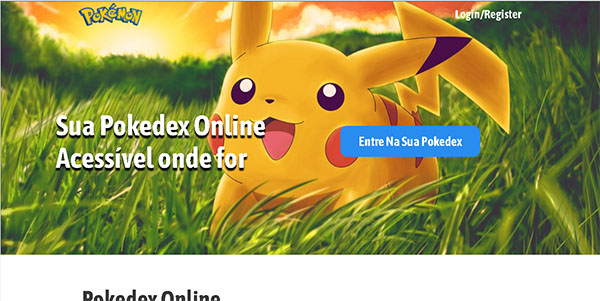

# Pokedex Online

This project aims to recreate the Pokedex of the Pokemon anime, in order to practice web development.

 
 
<h1>Technologies Used</h1>
<h2> FrontEnd </h2>
 

 Jquery

HTML 5, CSS 3(pure), JavaScript

 
<h2> BackEnd </h2>

Database: MySQL

PHP 7

Slim Framework

 
<h2>Project Language</h2>

Portuguese - Brazil (Pt-Br)

