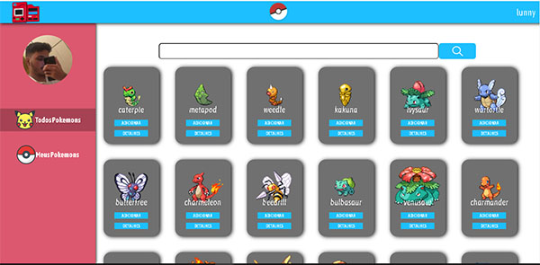
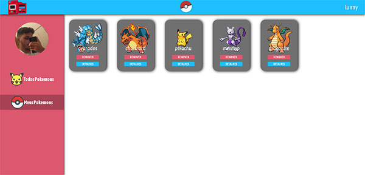
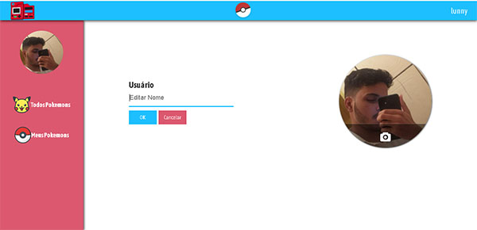
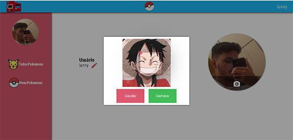

# Pokedex Online

This project aims to recreate the Pokedex of the Pokemon anime, in order to practice web development.

 
 
<h2>All Pokemons</h2>
List of All Pokemons, accessible to the user

 
<h2>My Pokemons</h2>
The user can also add pokemon to his personal pokedex

 
<h2>Edit Profile</h2>
The user can personalize his profile, being able to change his username and his profile photo

Changing Username

Changing Profile Photo

 
 
<h1>Technologies Used</h1>
<h2> FrontEnd </h2>
 

 Jquery

HTML 5, CSS 3(pure), JavaScript

 
<h2> BackEnd </h2>

Database: MySQL

PHP 7

Slim Framework

 
<h2>Project Language</h2>

Portuguese - Brazil (Pt-Br)

